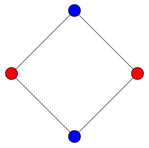
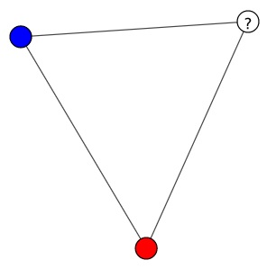
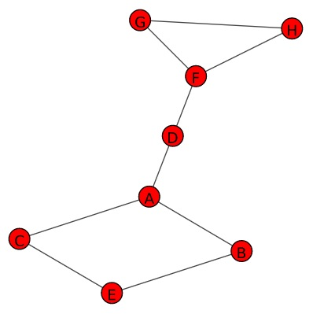

# Detecting 2-colorable graphs

A graph is called **2-colorable** if its nodes can be assigned two colors, say
red and blue, in such a way that no two nodes that are joined by an edge have
the same color.

For example, this graph is 2-colorable:



while this graph is not, because the node labeled "?" cannot be colored either
red or blue without having the same color as one of its neighbors:



Assuming that a graph is connected, we can determine whether it is 2-colorable
by assigning one color to a starting node, then the opposite color to its
neighbors, and so on. If we reach a point where a node has a neighbor that has
already been assigned the same color previously, then we know the graph isn't
2-colorable. Otherwise if we can assign colors to all nodes, the graph is
2-colorable.

The file `01_is_2_colorable.py` in this repository contains a class definition
for a graph node and the skeleton of a function `is_2_colorable` which accepts
as input a list of nodes. An instance of `Node` has a property `color` which is
initially `None`, but can be changed during processing. You will need to
implement the strategy described above to complete this function. The file also
contains some test cases.

Here is another example of a graph that is not 2-colorable:



This graph can be constructed using the `Node` class as follows:

```python
A = Node("A")
B = Node("B")
C = Node("C")
D = Node("D")
E = Node("E")
F = Node("F")
G = Node("G")
H = Node("H")

A.neighbors = [B, C, D]
B.neighbors = [A, E]
C.neighbors = [A, E]
D.neighbors = [A, F]
E.neighbors = [B, C]
F.neighbors = [D, G, H]
G.neighbors = [F, H]
H.neighbors = [F, G]
```
